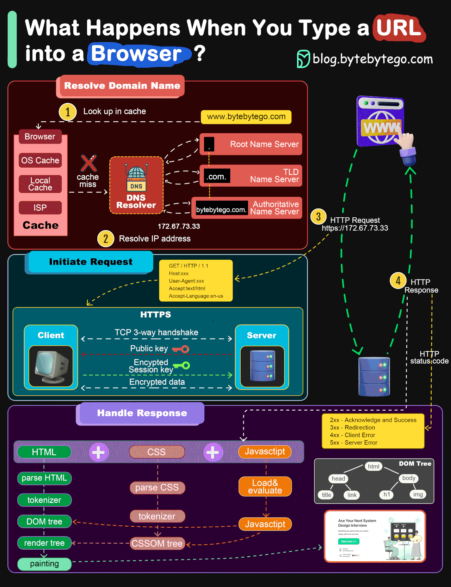

[//]: # (![Alt Text]&#40;assets/images/browser_works.gif&#41;)

# Summary
This is the summary of all key and critical aspects of FE dev

## HTML breakdown
HTML = Collection of nested tags with attributes ~ 20% of tags are used 80% of the time

## JS breakdown
JS = Core JS(X) + Libs
JS = Core JS + React JSX
Key libs = CSS-IN-JS + Hooks + State management + HTTP
Automated tests

## CSS breakdown
CSS = Base(Static) + Responsive + Advanced(Dynamic)
Base = Layouts + Colors + Typography + Spacing
Advanced = Transitions + Animations
Design system

## Web design breakdown
- Design system = Design tokens + Component library + Layout patterns
- [Style Dictionary](https://github.com/amzn/style-dictionary)
- [Material Design Guidelines](https://m2.material.io/design/guidelines-overview)

## Useful patterns
- Design system -> consistent(!) colors, typography, sizing & spacing -> theming, faster dev time
- Layout patterns -> 16 basic layout patterns -> 1 pattern = gotchas + 1+ implementations
- Image URL enum -> collects all image URLs in one place
- API root + path enums -> easily change APIs
- Data access layer -> a special layer which wraps API access
- Custom hooks -> Implement business layer

## Key concerns
### Developer experience
- Which tools to you ? How to use them best ?

### Dependencies
- Choosing and importing the right dependencies
- Updating dependencies -> vulnerabilities, bug fixes and improvements
- Preventing dependency conflicts

### Layouts
- Getting the layouts right and making them consistent
- Making the layouts responsive

### Styling
#### Consistency
- Across browsers -> normalize.css
- Colors
- Typography
- Layouts and spacing

### Business logic
- How to structure the code ?
- What should the folder structure be in the project ?

### API interactions
- How to keep the code clean
- How to keep the code performant

### Build and deploy
- Choosing a rendering strategy: SSG vs SSR vs CSR
- Creating and deploying a production build

### Performance optimization
- Core web vitals: https://pagespeed.web.dev/
- Web performance optimization -> lazy loading, code splitting, tree shaking (webpack)
- Rendering strategies -> client side, SSG, SSR

### Etc
- Storybook -> design system
- SEO
- Web Accessability
- Google analytics, etc.
- Debugging
- Using websockets with the BE basics
- Using PWA features basics
- Microfrontends basics
- GraphQL basics

# Learning Process
## Questions

### Consistency/Reusability
- How to ensure consistent gaps everywhere?
- How do I design reusable components ? Think buttons with rounded corners ? How to avoid prop overload ?

### Features
- What are the key aspects/features of next.js ?
- How can I leverage bootstrap and other UI libs as much as possible ? How do I make them customizable ?

### Layouts 
- How create high quality and clean high level layouts ?
- How do I master creating layouts 
- What are common layout pattrens ? How can I easily implement them ?

### Clean code & clean architecture
- Which patterns and best practices can I use ?
- How can I structure my app in layers ? Do I use classes or functions ?
- How can I structure my FE into modules ?
- Best practice around next.js 13 project structure ?

## Drills
- D1 -> Making layouts -> Get a list of layout patterns from ChatGPT and implement them using grid/flexbox
- D2 -> Absolute positioning -> Grab a bunch of elements and position them in crazy places
- D3 -> Hooks + custom hooks. Come up with ways to use hooks in all ways and then extract this logic into custom hooks
- D4 -> Context. Learn to implement contexts and pass data around using them
- D4 -> Redux -> Practice using redux and mapping state and dispatch to props
- D5 -> Layering -> Read a few articles/projects about layering and do 3 projects with layers
- D6 -> Animations -> Start with basic and move on to more advanced animations
- D7 -> Project generators -> Try out a few and check that you get a project with all dependencies configured
- D8 -> Responsive design -> Create a few designs which are effortlessly responsive
- D9 -> Using libraries. Integrate about 20 different libraries and try to use them
- D10 -> Component communications practice. Prop drilling, context, zustand

# General
- [FE Iceberg](https://youtu.be/KYDwcUKlxwQ?si=c1fEgtFuKB5XzE59)

# Languages
- JS
- Typescript

## Async JS
- [The issue of callback hell](http://callbackhell.com/)

# Next.js
- Next.js routers & navigation -> pages and app
- Next.js using Layout component for consistent layouts
- Next.js auth
- Next.js internationalization
- Next.js performance optimization
- Next.js rendering strategies -> SSG, SSR, CSR
- Alternative: after.js, refine.js

# Tools 🛠
## Figma
- Figma basics
- How to convert figma to code while preserving spacing
- [Web design basics](https://youtu.be/cKZEgtQUxlU?si=FqL5wcqL_PCeGMuy)
- How to convert figma to code ?
- Design token export: https://www.figma.com/community/plugin/888356646278934516/design-tokens

## CLI utils
- Project boilerplate generators -> superplate, refine
- Package manager -> npm, yarn
- Linter -> eslint, prettier (Something to create a fixed order of CSS properties?)
- CLI node utilities -> npm, npx, nvm
- Husky for precommit hooks
- Pocketbase -> DB for project

## Browser dev tools
- Chrome Dev Tools, Firefox for developers
- Lib inspector tools -> react, redux, react-query

## Other
- [CSS Generators](https://css-generators.com/) -> gradient, shadow, text shadow, animation, transformation
- [Security basics](https://youtu.be/QqXEUVOA9Fo?si=ppBMIjdg4uvtKWGz)

# React
- [Has high quality docs](https://react.dev/learn)
- [Introduction to react(rus)](https://www.youtube.com/live/bnzcSC8AmHY?si=qv93OnB0lxIdXIjt)
- [React key feature overview](https://youtu.be/0UbkJ6Izue8?si=52raSfE1BFvBmhYg)
- [Advanced React](https://www.youtube.com/live/HDajDASxn-w?si=SXyMq5_3UO5WxHbo)
- [Rendering process](https://youtu.be/i793Qm6kv3U?si=qaGb_ki4xuPtBfC2)
- [React app architecture](https://youtu.be/Zy-Oj6qs8vo?si=vvyafZWgrCoO0-NK)
- [React lib ecosystem](https://www.youtube.com/live/vfoLoTGa6Sw?si=uJo0AbEWVeN_-s9W)
- [Building a complex component](https://youtu.be/w0Kvt65Z2Uk?si=kh2RNJTygTauM0Ll)

## Hooks
- [React hook rules](https://legacy.reactjs.org/docs/hooks-rules.html)
- useState
- [useEffect](https://youtu.be/bGzanfKVFeU?si=muTo5Ev4lEx-0S6X)
- [useEffect use cases](https://dev.to/colocodes/6-use-cases-of-the-useeffect-reactjs-hook-282o)
- useRef
- useContext
- useReducer
- custom hooks as a way to extract and reuse logic across components
- chakrai-ui hooks
- use-hook library & other hook libraries

## Libs
- React Query & 1 alternative
- Client state; Zustand, Redux, Redux toolkit
- [State machine implementation lib](https://stately.ai/docs/xstate-react/)
- React error boundary

## Patterns
- React component patterns
- React component interaction patterns

# CSS
## Core CSS
### Basic concepts
- Excellent intro: https://cssdemystified.com/
- Fundamentals: box-model, inheritance, cascading
- Reset -> box-sizing: border-box, normalize.css, 10px per rem

### Layouts
- [Layouts intro](https://youtube.com/shorts/ZOOYkJw6TZc?si=5qUMxBWXnnmp0Co0)
- Normal flow
- Display
- Position
- Flexbox
- Grid
- [MDN Guide](https://developer.mozilla.org/en-US/docs/Learn/CSS/CSS_layout) -> good theory
- Responsive design https://courses.kevinpowell.co/conquering-responsive-layouts https://scrimba.com/learn/responsive

### Layout patterns
#### Patterns
- https://web.dev/patterns/layout/
- Every layout

### Coloring
- Coloring -> shadows, gradients
- Typography -> font-* properties, inhertiance of font-* properties, typography theory basics

### Etc
- Transformations -> translate, rotate, scale
- Animations -> transition, @keyframes, will-change property, requestAnimationFrame

- Pseudo elements -> :hover, :active, :focus, :visited, :nth-child, ::before-after
- Pseudo classes -> :hover, :active, :focus, :visited
- Pseudo selectors -> :nth-child
- Media queries

- CSS modules
- Beyound CSS -> https://www.beyondcss.dev/

## CSS in JS
- Libs -> Styled components, styled-jsx, emotion
- Styled System (!!!)

# Libs
## Starter lib pack
### Main
- JS: typescript support
- CSS: styled-components, styled-system
- API: axios, react-query(prevents too much hits of the API(!!))
- Forms: react-hook-form
- Validation: Zod
- State management: zustand, immer

### Support
- Linting: eslint, prettier
- Unit Testing: jest, react-testing-library -> ???
- E2E Testing: ???

## Component libs

### Chakra UI
- [Chakra UI](https://egghead.io/courses/build-a-modern-user-interface-with-chakra-ui-fac68106)
- Layout components
- UI components
- Theming
- Overriding styling

### Other UI libs
- [All UI library overview](https://youtu.be/CQuTF-bkOgc?si=IC9QtlFq2yCeIC88)
- Bootstrap
- Material UI
- Tailwind CSS
- Build your own component lib and upload to NPM

### Headless component libs
These libs only provide hooks and let you style components how you want
- React Select
- React Table

### Table libs
- TanStackTable, AntDesign table

## Animation Libs
- @keyframes
- React Spring, Framer Motion

## Form Libs
- React hook form

## Validation Libs
- Zod, Yup, Joi

## HTTP Libs
- React Query, RTK Query
- fetch API, axios

### React query
- [React Query Tutorial](https://www.youtube.com/playlist?list=PLC3y8-rFHvwjTELCrPrcZlo6blLBUspd2)
- How to configure automated refetching ?
- How to configure cache invalidation ?
- How to use mutations ?
- How to use results of one request to send further requests ? Best way to implement this ?

## Data visualisation Libs  
- ChartJS, VictoryChart

## Component Design System Libs
- [Storybook in 100s](https://youtu.be/gdlTFPebzAU?si=g-MLDHS1cBeF6dfX)
- [Storybook](https://egghead.io/courses/integrate-storybook-in-a-next-js-application-b6dd4df3)

## Authentication Libs/Providers
- Firebase auth
- Auth0
- 1 more auth provider

## I18n Libs
- react-i18next
- 1 more libs

## Typography libs
- Typographer lib -> add link

## Testing libs
- Overview https://youtu.be/bvdHVxqjv80?si=FxTpZI-60I9jgMgS
- Jest
- React Testing Library
- Cypress

## Reactive libs
- RxJS -> NgRx
- Some 3D libs

# Clen code & clean architecture
- Clean code React
- Clean architecture React
- React patterns -> https://www.patterns.dev/posts
- [React patterns: component composition](https://youtu.be/vPRdY87_SH0?si=tHC0Lw6NsYhgeTVz)
- [React architecture & best practices](https://www.youtube.com/live/XNT5BozA9HA?si=umypoRC7UBOEplNI)

# SVG
- SVG basics
- SVG animations
- SVGR

# Cloud services
- Vercel -> quick deployment
- Firebase -> auth, db, backend as a service

# Web Design
- [UI/UX basics](https://www.refactoringui.com/)
- [UI element names](https://careerfoundry.com/en/blog/ui-design/ui-element-glossary/)
- [UI glossary](https://www.uxdesigninstitute.com/blog/ui-glossary/)
- [UX glossary](https://medium.com/@sarah.edwards/ux-glossary-b73e0a2e0a06)
- Site navigation
- Design tokens: colors, typography, spacing
- Layout

# Security
- XSS
- CSRF
- CORS
- SCP Headers
- SQL Injection

# Projects
- Do 5 projects based on Youtube tutorials based on react/next.js